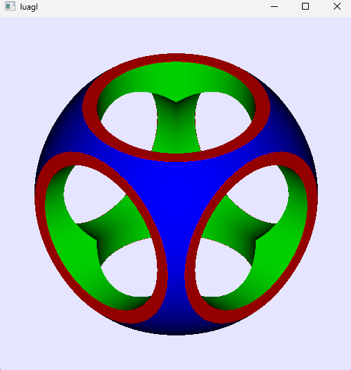

# luagl

## Description

Luagl is a Lua module for calling OpenGL easily. Original build for [luacg](https://github.com/waizui/luacg).


```Lua
local gl = require("luagl")

-- window needs to be initialized first
local win = gl.Window.new(512, 512)

local vertices = {
  1, 1, 0.0,
  1, -1, 0.0,
  -1, -1, 0.0,
  -1, 1, 0.0
}

local indices = {
  0, 1, 3,
  1, 2, 3
}

-- call this script from build folder
local vert = io.open("../test/vertex.vert", "r"):read("*a")
local frag = io.open("../test/fragment.frag", "r"):read("*a")

local shader = gl.Shader.new(vert, frag)
local rc = gl.RenderContext.new(shader, vertices, indices)

win:show(rc)
win:close()

```

this example opens a window and executes a shader program as following picture:



## Build

To use luagl, you need to build a Lua standalone interpreter from this repository, other interpreters will not work.
You also need to update dependecies under libs folder at first. 

```bash
# at root folder
mkdir build

cd ./build/

# if on windows, I recommand use Ninja: cmake -G "Ninja" ..
cmake ..

# after this you will get a luagl executable, this is the Lua interpreter
cmake --build .

```
## Tips

If you don't want to build it by yourself, pre-built executables are under bins folder.
